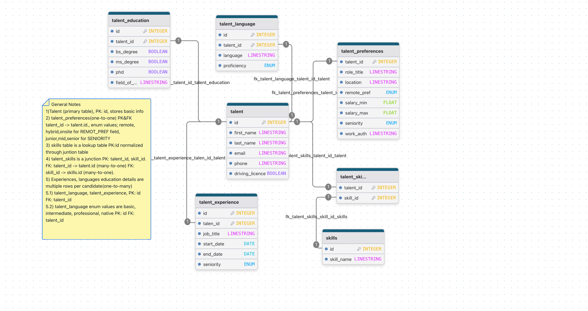

Part 2 Data Modeling and System Thinking

Part 2.1 Talent Schema

Part 2.2 Company Enrichment Design

a. We would use service APIs (like Apollo or any other tool) or do web scrawling to add extra company information. Generated/transformed data from sources stays seperated from the new company data, we match company names.
    a.1 Create company tables fetching via APIs; 

           - companies table: id, name, domain
           - company_enriched table: company_id, apollo_id, industry, employee_count, revenue, etc. (needs Apollo/web analyze to define)
b. companies table and added enrichment should be seperated. With this way enrichment can be updated without loosing old info. one to many relation. one company can have many enrichment records

c. 

     -industry information: companies can be groupped by industry then analyze for sectors
    - emplooye count: shows how big is the company 
    - funding shows how much money the company raised this can show new hirings etc.
    - locations: shows demands by region

d. Identity resolution consideration

    - we already matched by domain using URL field
    - Apollo or other tools usually are highly accurate in case we use services
    - if company names match with other company a rules based conditioning can be created. 

Part 2.3 Job-Talent Matching

Approach: Using jobs and talent data the approach could be weighted features (skills, location, seniority, past experience, education level) to create a score to match job and the candidate. We can also implement/train decision tree model (this might be a future work). Embeddings, semantic search might be use as state of the art AI models.

a. output score for match using weighted features. For decision tree it can be low normal high classifactions.

b.MVP: 

        -Rule‑based weighted scoring – simple, no training data needed.
AI signals(future):

        - Embeddings for semantic matching (job description talent experience), decision tree after collecting historical placement data.

Part 2.4 Hiring Intent

a. Signals :    
                
              - when the job post is opened? 
             - how many talent will be hired?
             - recent funding (from enrichment)
             - new location (from enrichment)
             - Is it urgent(possible starting date)  

b. MVP vs AI: 

            - MVP: add score again, rule based threshold (0-10)
            - AI: train on historical job posting data (if it exists) penalize for repeated posts. time-series forecasting (maybe?)

c. Confidence Score:

            - for MVP: map score to low medium or high intend
            - accuracy for trained model %80<

d. Limitations:

            - Internal CVs
            - referrals
            - agencies 
            - duplicated posts

     

